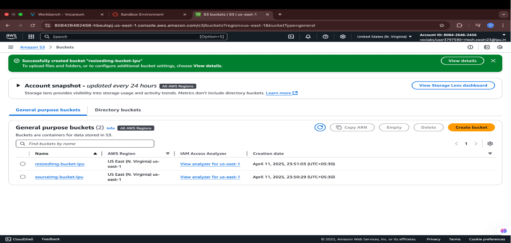

# 🖼️ Serverless Image Resizer (AWS Lambda + S3)  
*By Ritesh Swain*  

A proof-of-concept simulating **automated image resizing** using AWS serverless services.  
*(Project archived due to AWS account closure.)*  

---

## 📌 Overview  
- **Trigger**: Upload an image to `sourceimg-bucket-lpu`.  
- **Processing**: AWS Lambda resizes the image using Python (Pillow).  
- **Output**: Saves resized version to `resizedimg-bucket-lpu`.  
- **Logging**: CloudWatch tracks execution status.  

  

---

## 🛠️ Implementation Steps  

### 1. AWS Infrastructure Setup  
- Created two S3 buckets:  
  - **Source**: `sourceimg-bucket-lpu` (original images)  
  - **Destination**: `resizedimg-bucket-lpu` (processed images)  
- Configured Lambda to trigger on S3 uploads.  

  

### 2. Lambda Function (Python)  
- Used **Pillow** (`PIL`) for image processing.  
- Packaged dependencies as a **Lambda Layer**.  

```bash
pip install Pillow -t .  # Local install for Lambda Layer